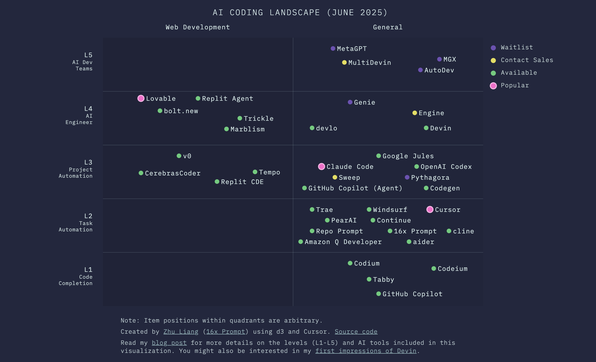
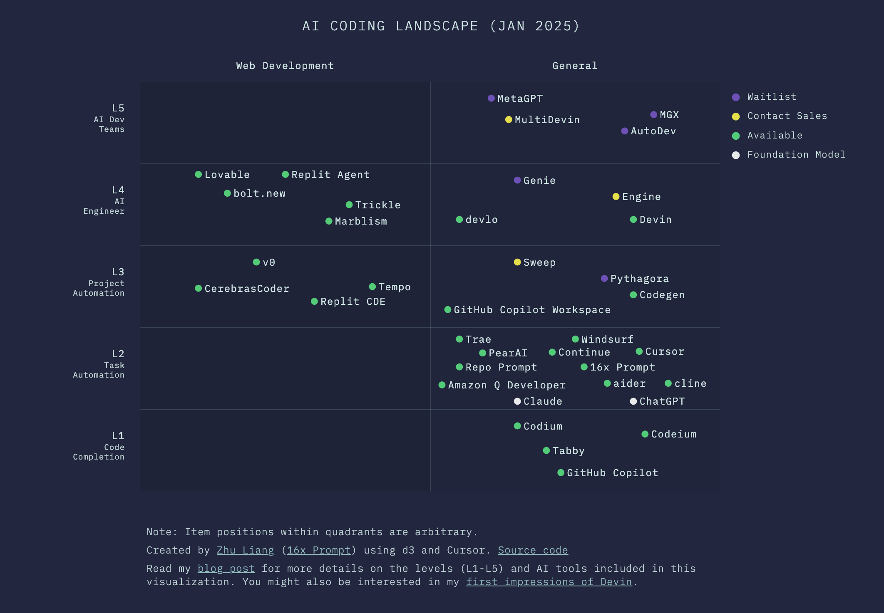

# AI Coding Landscape

AI Coding Landscape visualization.

Live interactive website: [https://paradite.github.io/ai-coding/](https://paradite.github.io/ai-coding/).

For more details, please refer to the [blog post](https://prompt.16x.engineer/blog/ai-coding-l1-l5).

## Snapshots

June 2025:



January 2025:



## Running locally

```bash
$ python3 -m http.server 8000
```

Then open your browser and go to

- `http://localhost:8000`
